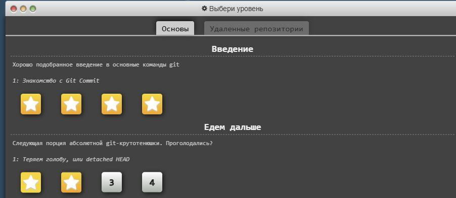
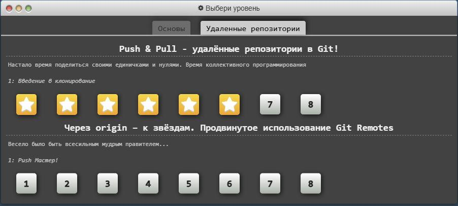
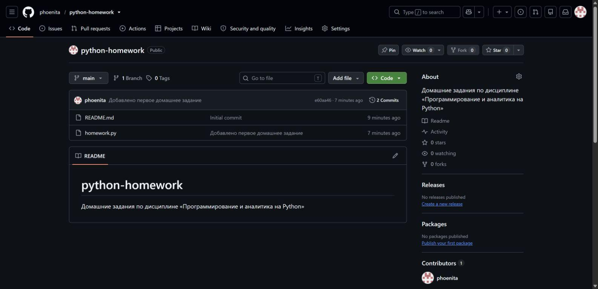

# Домашнее задание 1

Остапенко Алёна, группа УЦП-25.

## Задание 1. Тренажёр Learn Git Branching

Я прошла все 4 уровня раздела «Введение» и первые 2 уровня раздела «Едем дальше» на вкладке «Основы».



На вкладке «Удалённые репозитории» я прошла первые 6 уровней раздела Push & Pull.



Из-за технической ошибки сайта я использовала локальную копию официального проекта Learn Git Branching. Задания и проверку решений не изменяла. На скриншотах пройденные уровни отмечены звёздами.

## Задание 2. Репозиторий GitHub

Я установила Git на компьютер, версия 2.55.0.windows.3. Создала репозиторий `python-homework` в аккаунте `phoenita`, склонировала его на компьютер и добавила файл `homework.py`. Сохранила изменения коммитом и отправила их на GitHub.

Мой репозиторий: [phoenita/python-homework](https://github.com/phoenita/python-homework).

Я создала коммит `e60aa46` с сообщением «Добавлено первое домашнее задание». На скриншоте я зафиксировала состояние репозитория после отправки коммита: в нём отображаются `README.md` и `homework.py`.



### Команды, которые я использовала

```bash
git clone https://github.com/phoenita/python-homework.git
cd python-homework
git add homework.py
git commit -m "Добавлено первое домашнее задание"
git push origin main
```
